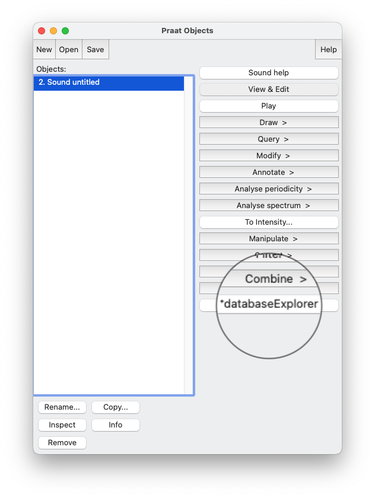

# About
DatabaseExplorer is a [Praat](https://www.fon.hum.uva.nl/praat/) plugin for you to intuitively inspect a folder containing speech files, cut them into snippets and save them to a different location, with just some simple clicks of your mouse.

Databases typically have many files in one directory. In Praat it can be a bit bulky to run through a file collection. The fundamental idea of databaseExplorer is that you can simply loop through a number of files in a directory and can carry out simple edits. To change from one file to the next or back, you can simply use the arrow buttons.

- Input: Sound object(s) selected in Praat object window.
- Output (optional): Sound with a TextGrid taht is saved in a directory of your choice. 

# Demonstration
This short **[video](https://www.youtube.com/watch?v=fjlFNOzfdPo)** produced by Clemens Lutz from LiRI Resource Hub efficiently demonstrates you everything about databaseExplorer, from the installation to the usage. Be sure to ckeck it out 😉!

# Installation
For this one, we created a convenient installation script: simply run installation.praat, it copies the databaseExplorer.praat (therefore make sure theses two files are in the same folder when you run it) to your folder and adds the databaseExplorer button to your dynamic object window. 

Once installation done, you can delete your temporary files used for installation.

  

# Author
[Prof. Volker Dellwo](https://www.liri.uzh.ch/en/aboutus/Volker-Dellwo.html)

# Question, Feedback and Contribution
We appreciate any question, feedback and contribution to the code, please refer to the [general contribution guide](https://docs.github.com/en/pull-requests/collaborating-with-pull-requests/proposing-changes-to-your-work-with-pull-requests/about-pull-requests) for more information.

# License
This program is free software: you can redistribute it and/or modify it under the terms of the GNU General Public License as published by the Free Software Foundation (see <http://www.gnu.org/licenses/>). This program is distributed in the hope that it will be useful, but WITHOUT ANY WARRANTY.
