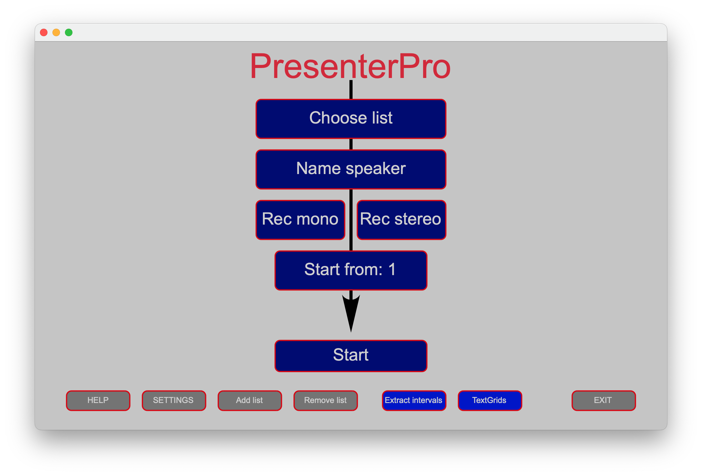
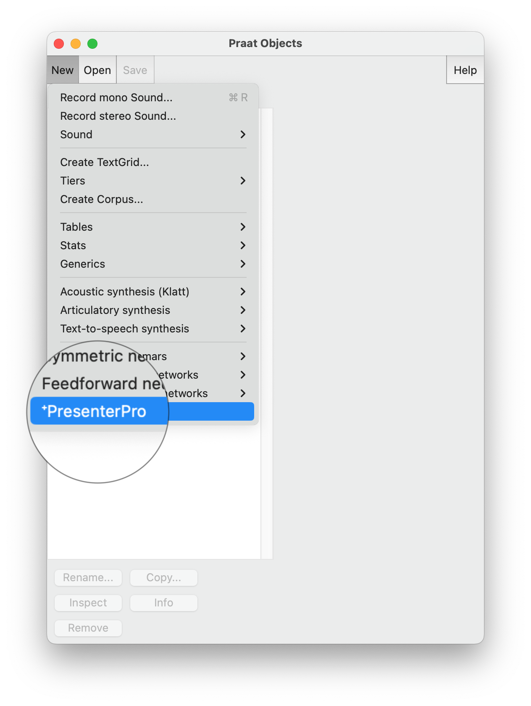

# About
[PresenterPro](https://www.zora.uzh.ch/id/eprint/127817/1/P%26P2016_Dellwo.pdf) is a plug-in for Praat developed by [Prof. Volker Dellwo](https://www.linguistik.uzh.ch/de/about/mitglieder/dellwo.html), designed to assist with recording, indexing, and processing prompted speech. 

[Praat](https://www.fon.hum.uva.nl/praat/) is a free and open-source software developed by Paul Boersma and David Weenink at the University of Amsterdam, specifically designed for the scientific analysis of speech in the field of phonetics. It enables users to analyse, synthesize, and manipulate speech, and is capable of handling various types of acoustic analyses such as those involving spectrograms, pitch, and intensity. 

However, Praat lacks some essential features for prompting speech during recordings, such as displaying lists of words or sentences on a screen for a speaker to read and then indexing these recordings for later analysis. PresenterPro addresses these gaps by prompting the reader to read from a screen, indexing the recordings in a Praat TextGrid, and extracting the recordings into individual files very easily.

# Demonstration
This short **[video](https://www.youtube.com/watch?v=fjlFNOzfdPo)** produced by Clemens Lutz from LiRI Resource Hub efficiently demonstrates you everything about PreserterPro, from the installation to the usage. Be sure to ckeck it out 😉!

# Installation
- Method 1 (recommended): Copy the directory `./plugin_PresenterPro` into the [Praat preferences directory](https://www.fon.hum.uva.nl/praat/manual/preferences_folder.html): \
  Assuming you're user `liri`:, \
  on Windows: `C:\Users\liri\Praat\`; \
  on MacOS: `/Users/liri/Library/Preferences/Praat Prefs/`; \
  on Linux: `/home/liri/.praat-dir/`.\
  Then reopen Praat, PresenterPro automatically appears in Praat under ‘New > PresenterPro’, in Praat Objects window.
- Method 2: Execute the script `setup.praat` that’s inside the directory. \
  **Note**: if using this method, the plugin folder should not be moved somewhere else after executing the script, otherwise it couldn’t be found next time. Therefore highly recommend to use method 1.

  

# Author
[Prof. Volker Dellwo](https://www.liri.uzh.ch/en/aboutus/Volker-Dellwo.html)

# Question, Feedback and Contribution
We appreciate any question, feedback and contribution to the code, please refer to the [general contribution guide](https://docs.github.com/en/pull-requests/collaborating-with-pull-requests/proposing-changes-to-your-work-with-pull-requests/about-pull-requests) for more information.

# License
This software is lisenced under the copyleft license GPL v3, meaning that any copy of modification of the original code must also be released under the GPL v3.
